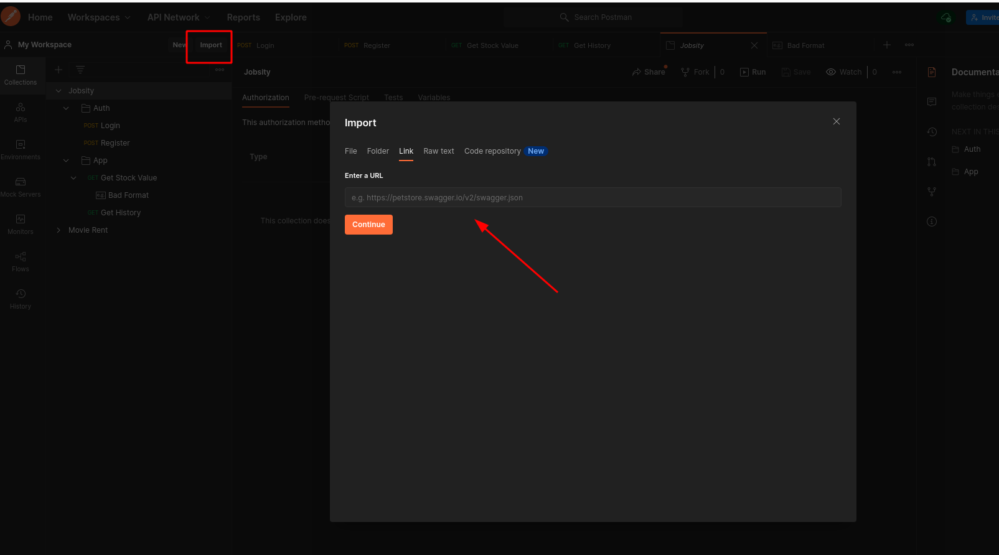

## PHP Challenge

### Requirements
 - Docker

### How to install

run the following commands

1. copy _.env.example_ -> _.env_
2. set a password for the **DB connection**
3. Set up the MAILER config **(i used mailtrap.io)**
4. docker-compose build
5. docker-compose up -d
6. ./composer install
7. ./phinx migrate
8. ./phinx seed:run
9. create variable APP_END={VALUE}

NOTE: the password of the **mysql** docker image will be the same as the one you set up on the .env on **DB_PASSWORD**

### How to test

1. Copy the link of this [collection](https://www.getpostman.com/collections/ad4c38672c19e9e2a429)
2. Import the collection into Postman
   - click on import and then past the link

### features

1. register users
2. login user with JWT
3. fetch stock data
   - send email with the stock data
   - fetch data in json o csv format
5. fetch user history
